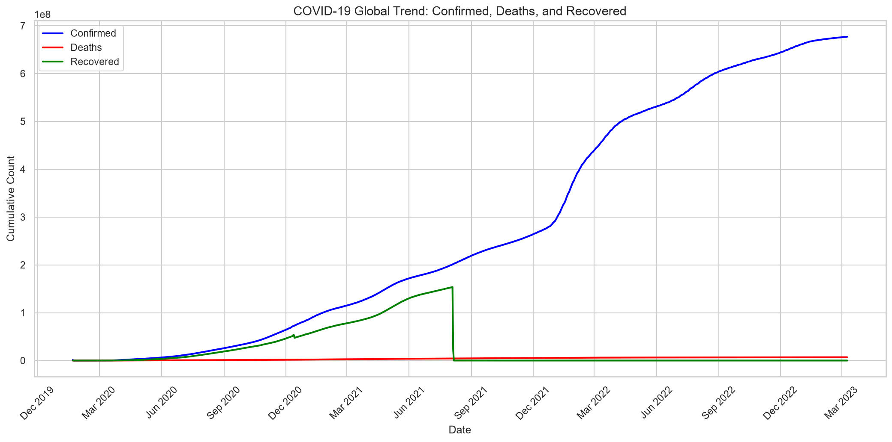
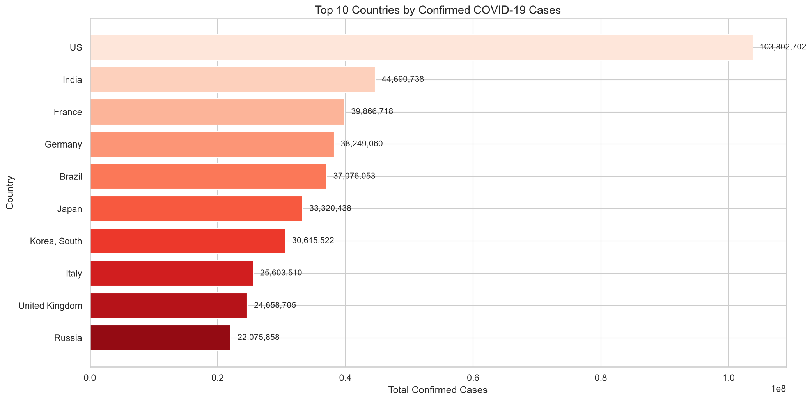
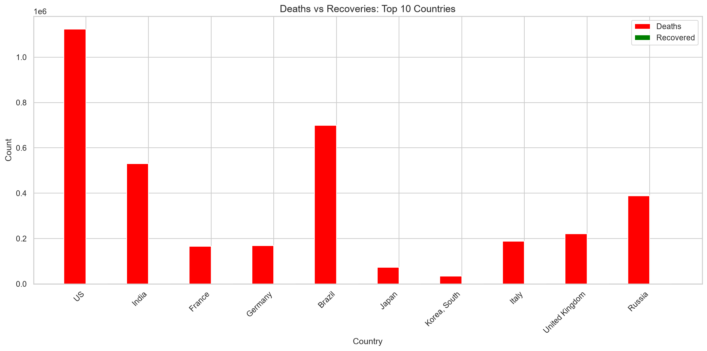
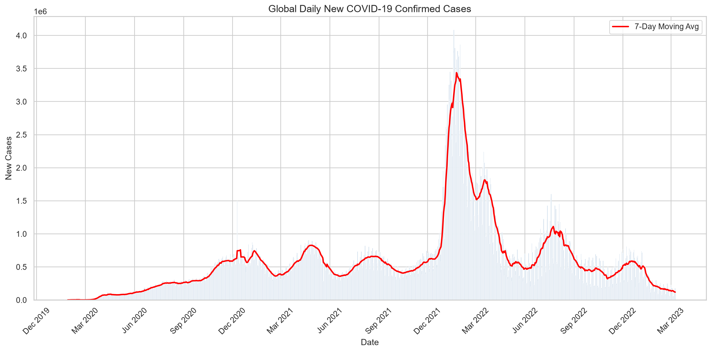
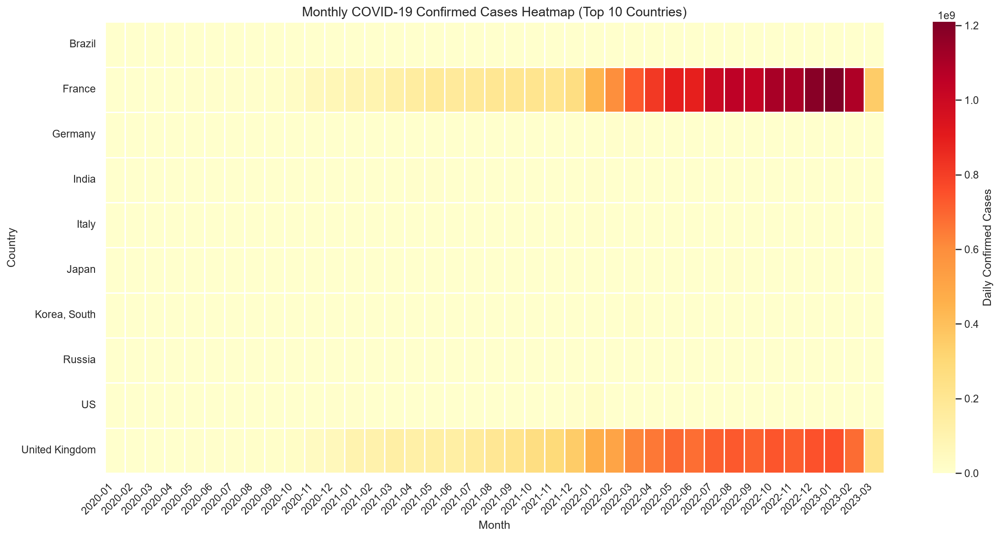
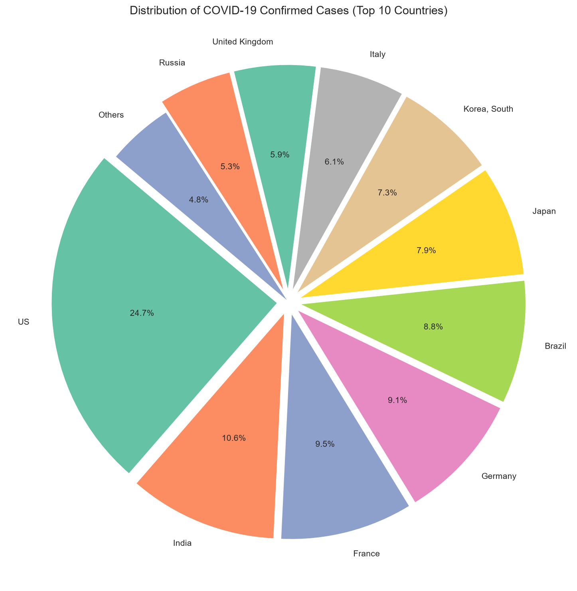
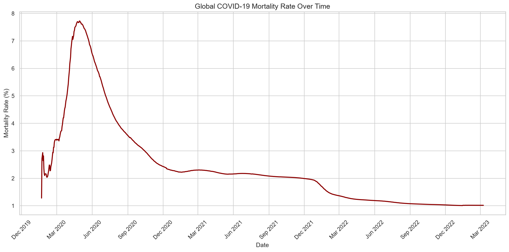
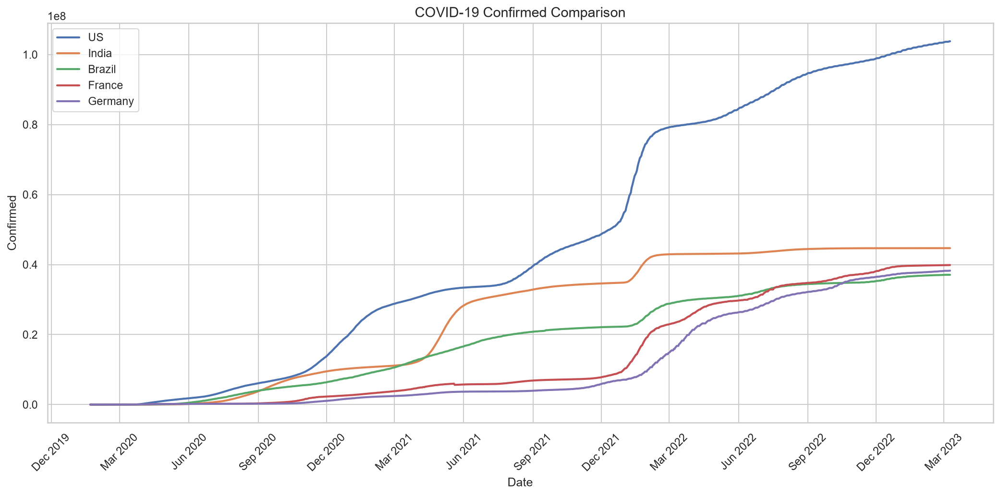
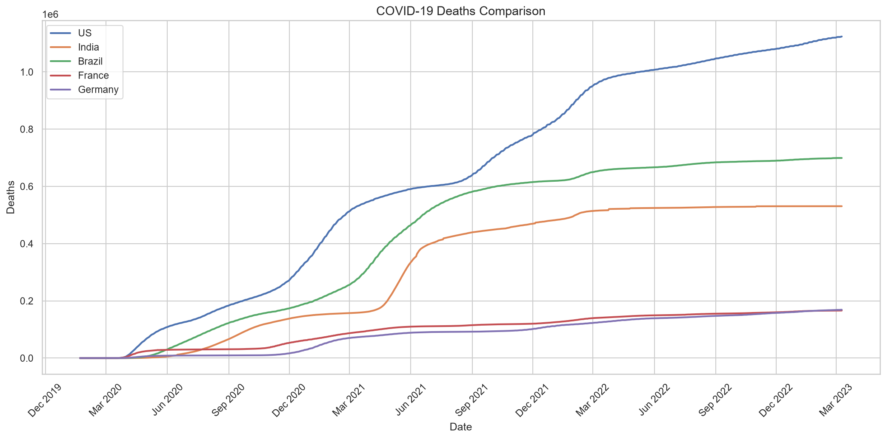

# 🦠 COVID-19 Data Analysis and Visualization System

> A Python-based data analysis and visualization project that explores global COVID-19 time-series data to identify trends, patterns, and meaningful insights through effective data visualization.

---

## Badges


---

## Project Overview

The COVID-19 pandemic generated enormous volumes of data across countries and time periods. Understanding this data is critical for gaining insights into how the pandemic evolved globally. This project performs a **comprehensive analysis of the global COVID-19 pandemic** using the time-series dataset maintained by the **Johns Hopkins University Center for Systems Science and Engineering (JHU CSSE)**.

Developed as part of a **Data Analyst Internship**, this project transforms raw COVID-19 data into meaningful visual insights by applying a complete data analytics workflow: from data collection and cleaning to exploratory analysis, trend analysis, country-wise comparison, and publication-quality visualization.

The project is implemented in two forms:
- A **standalone Jupyter Notebook** (`COVID_19_Data_Analysis_and_Visualization.ipynb`) for interactive exploration
- A **modular Python pipeline** (`src/` package + `main.py`) for reproducible, script-based execution

---

## Problem Statement

COVID-19 datasets contain large amounts of information, including cumulative confirmed cases, deaths, recoveries, geographic coordinates, and dates spanning hundreds of countries over several years. Manually analyzing such datasets is impractical and error-prone. This project addresses the challenge of extracting **clear, actionable insights** from this complex, multi-dimensional data through systematic data analysis and effective visualization techniques.

---

## Objectives

- Load and inspect multi-source COVID-19 time-series datasets
- Clean and preprocess raw wide-format data into analysis-ready format
- Perform Exploratory Data Analysis (EDA) to uncover patterns and relationships
- Analyze global, weekly, and monthly trends in confirmed cases, deaths, and recoveries
- Compute growth rates and doubling times to characterize pandemic trajectory
- Compare COVID-19 statistics across countries and regions
- Create meaningful visualizations using Matplotlib and Seaborn
- Derive actionable insights and key findings from the analysis
- Gain practical experience in the end-to-end Data Analyst workflow

---

## Key Features

- **Automated Data Collection** -- Downloads COVID-19 datasets directly from the JHU CSSE GitHub repository
- **Wide-to-Long Format Conversion** -- Melts date columns into rows for time-series analysis
- **Multi-Source Data Merging** -- Combines confirmed, deaths, and recovered datasets into a unified DataFrame
- **Missing Value Handling** -- Detects and fills missing values using forward-fill and zero-fill strategies
- **Derived Column Engineering** -- Computes daily new cases, active cases, mortality rate, and recovery rate
- **Country-Level Aggregation** -- Aggregates province-level data to country level
- **Exploratory Data Analysis** -- Dataset overview, statistical summaries, correlation analysis, and distribution analysis
- **Trend Analysis** -- Global daily, weekly, and monthly trends with growth rate and doubling time calculations
- **Country-Wise Ranking** -- Top countries by confirmed cases, deaths, mortality rate, and recovery rate
- **Publication-Quality Visualization** -- 9 chart types including line plots, bar charts, heatmaps, and pie charts

---

## Dataset

**Dataset:** Global COVID-19 Time-Series Data

**Source:** Johns Hopkins University CSSE (via Kaggle)

**Kaggle Link:** [Global COVID-19 Dataset -- Kaggle](https://www.kaggle.com/datasets/thedevastator/global-covid-19-data)

**JHU Repository:** [JHU CSSE COVID-19 Dataset on GitHub](https://github.com/CSSEGISandData/COVID-19)

The dataset consists of three CSV files recording cumulative COVID-19 statistics by country/region and province/state:

| File | Description |
| --- | --- |
| `time_series_covid19_confirmed_global.csv` | Cumulative confirmed cases |
| `time_series_covid19_deaths_global.csv` | Cumulative deaths |
| `time_series_covid19_recovered_global.csv` | Cumulative recoveries |

Each file contains columns for `Province/State`, `Country/Region`, `Lat`, `Long`, followed by date columns spanning from **January 22, 2020** to **March 9, 2023**.

> The dataset files are included in the `data/` directory of this repository.

---

## Technologies Used

| Technology | Purpose |
| --- | --- |
| Python | Core programming language for data analysis |
| Jupyter Notebook | Interactive development and analysis environment |
| Pandas | Data manipulation, merging, grouping, and transformation |
| NumPy | Numerical operations and array computations |
| Matplotlib | Static data visualization and chart generation |
| Seaborn | Statistical visualization and enhanced aesthetics |
| Requests | Automated dataset downloading from GitHub |

---

## Project Workflow


---

## Methodology

### 1. Data Collection
The three CSV datasets are downloaded from the JHU CSSE GitHub repository using the `requests` library. Files are saved locally to the `data/` directory.

### 2. Data Loading
Datasets are loaded into Pandas DataFrames using `pd.read_csv()`. Dataset shapes and structure are inspected.

### 3. Data Preprocessing
- **Wide-to-Long Conversion:** Date columns are melted into rows, creating a long-format time-series DataFrame
- **Merging:** Confirmed, deaths, and recovered DataFrames are merged on metadata columns and date
- **Missing Values:** Filled using forward-fill for numeric columns, with zero-fill as fallback
- **Derived Columns:** Daily new cases/deaths/recoveries (via `diff()`), active cases, mortality rate, and recovery rate are computed
- **Country Aggregation:** Province-level data is summed to the country level

### 4. Exploratory Data Analysis
- Dataset overview (shape, columns, data types, missing values, duplicates)
- Statistical summaries (mean, median, standard deviation, skewness)
- Time range information
- Top and bottom country rankings
- Correlation analysis between numeric variables
- Distribution analysis of key metrics

### 5. Trend Analysis
- **Global Daily Trends:** Aggregated daily totals across all countries
- **Weekly Trends:** Weekly aggregated case counts
- **Monthly Trends:** Monthly aggregated totals with mortality rate
- **Growth Rate Analysis:** Day-over-day percentage growth rates
- **Doubling Time Analysis:** Estimated doubling time using logarithmic formula

### 6. Country-Wise Analysis
- Top 10 countries by confirmed cases, deaths, mortality rate, and recovery rate
- Simplified continental/regional aggregation
- Direct country comparisons (e.g., US vs India vs Brazil)

### 7. Visualization
Nine publication-quality charts are generated and saved to the `outputs/` directory.

### 8. Results & Interpretation
Key findings are extracted, including global totals, peak dates, mortality trends, and regional disparities. Conclusions summarize the overall pandemic trajectory.

---

## Visualizations

The project generates **9 charts** saved in the `outputs/` directory:

### 1. Global Trend -- Cumulative Confirmed, Deaths, and Recovered


### 2. Top 10 Countries by Confirmed Cases


### 3. Deaths vs Recoveries Comparison


### 4. Global Daily New Cases with 7-Day Moving Average


### 5. Monthly Heatmap -- Top 10 Countries


### 6. Distribution of Confirmed Cases -- Pie Chart


### 7. Global Mortality Rate Trend


### 8. Country Comparison -- Confirmed Cases


### 9. Country Comparison -- Deaths


---

## Project Structure

```text
COVID-19-Data-Analysis/
|
|-- COVID_19_Data_Analysis_and_Visualization.ipynb   # Main Jupyter Notebook
|
|-- notebooks/
|   +-- covid19_analysis.ipynb                       # Module-based notebook
|
|-- src/
|   |-- __init__.py
|   |-- main.py                                      # Pipeline orchestrator
|   |-- data_collection.py                           # Data download & loading
|   |-- data_preprocessing.py                        # Cleaning & transformation
|   |-- eda.py                                       # Exploratory Data Analysis
|   |-- trend_analysis.py                            # Trend & growth analysis
|   |-- regional_analysis.py                         # Country-wise comparison
|   |-- visualization.py                             # Chart generation
|   +-- results_interpretation.py                    # Findings & conclusions
|
|-- data/
|   |-- time_series_covid19_confirmed_global.csv
|   |-- time_series_covid19_deaths_global.csv
|   +-- time_series_covid19_recovered_global.csv
|
|-- outputs/
|   |-- 01_global_trend.png
|   |-- 02_top10_countries_bar.png
|   |-- 03_deaths_vs_recovered.png
|   |-- 04_daily_new_cases.png
|   |-- 05_monthly_heatmap.png
|   |-- 06_pie_distribution.png
|   |-- 07_mortality_trend.png
|   |-- 08_country_comparison_confirmed.png
|   +-- 08_country_comparison_deaths.png
|
|-- requirements.txt
+-- README.md
```

---

## Installation and Setup

### Prerequisites
- Python 3.7 or higher
- pip package manager

### Steps

1. **Clone the repository**
```bash
git clone https://github.com/PriyankaNadikota/covid19-visualization.git
cd covid19-visualization
```

2. **Create a virtual environment** (recommended)
```bash
python -m venv venv
```

3. **Activate the virtual environment**

   **Windows:**
   ```bash
   venv\Scripts\activate
   ```

   **macOS/Linux:**
   ```bash
   source venv/bin/activate
   ```

4. **Install dependencies**
```bash
pip install -r requirements.txt
```

---

## Running the Project

### Option 1: Jupyter Notebook (Recommended)

1. Launch Jupyter Notebook:
```bash
jupyter notebook
```

2. Open `COVID_19_Data_Analysis_and_Visualization.ipynb`

3. Run all cells sequentially from top to bottom

### Option 2: Python Script Pipeline

1. Run the complete pipeline:
```bash
python src/main.py
```

This executes the full analysis pipeline from data collection to visualization. Charts are saved to the `outputs/` directory.

---

## Key Insights

- **Global Impact:** The pandemic affected over 200 countries and territories, with cumulative confirmed cases reaching hundreds of millions by March 2023
- **Disproportionate Burden:** A small number of countries, including the US, India, and Brazil, accounted for a significant share of global cases and deaths
- **Wave Pattern:** Distinct pandemic waves are visible in the daily new cases trend, each driven by new variants (Alpha, Delta, Omicron), with Omicron producing the highest daily case counts
- **Mortality Rate Decline:** The case fatality rate shows a general downward trend over time, likely due to improved treatments, vaccination campaigns, and better healthcare responses
- **Seasonality Effects:** Monthly patterns reveal surges often coinciding with winter months in the Northern Hemisphere
- **Doubling Time:** In early 2020, the doubling time of confirmed cases was extremely short, indicating exponential growth; doubling times increased as mitigation measures took effect
- **Regional Variation:** Asia and North America bore the highest case burdens, while mortality rates varied significantly across regions

---

## Limitations

- Analysis depends on the quality and completeness of the JHU CSSE source dataset
- Historical COVID-19 data may contain missing, inconsistent, or retrospectively adjusted values
- The dataset does not include vaccination data, which could enrich the analysis
- The continental/regional mapping uses a simplified manual lookup rather than a proper geographic dataset
- The project focuses on descriptive analysis and visualization; no predictive modeling is included

---

## Future Enhancements

- **Interactive Dashboard** -- Build an interactive dashboard using Plotly, Streamlit, or Dash for real-time data exploration
- **Power BI / Tableau Integration** -- Export processed data for business intelligence tools
- **Automated Data Updates** -- Schedule periodic data downloads to keep the analysis current
- **Geographic Visualization** -- Add choropleth maps using Folium or Plotly for spatial analysis
- **Predictive Modeling** -- Implement time-series forecasting models (ARIMA, Prophet) as a future extension
- **Vaccination Data Integration** -- Incorporate vaccination datasets for a more complete analysis

---

## Learning Outcomes

This project demonstrates practical skills in:

- **Python Programming** -- Modular, clean code with proper function design
- **Data Cleaning & Preprocessing** -- Handling wide-format time-series data, missing values, and data type conversions
- **Exploratory Data Analysis** -- Statistical summaries, correlation analysis, distribution analysis
- **Time-Series Analysis** -- Trend computation, growth rates, doubling time estimation
- **Data Visualization** -- Line charts, bar charts, heatmaps, pie charts with Matplotlib and Seaborn
- **Pandas** -- Data manipulation, merging, grouping, aggregation, and transformation
- **NumPy** -- Numerical operations and conditional computations
- **Data Interpretation** -- Extracting actionable insights from complex datasets

---

## Internship

This project was developed as part of a **Data Analyst Internship** and provided practical exposure to the complete data analytics lifecycle:

**Raw Data --> Collection --> Cleaning --> Preprocessing --> Analysis --> Visualization --> Insights**

The modular architecture and end-to-end pipeline demonstrate the ability to work with real-world datasets and deliver analytical outputs suitable for decision-making.

---

## Author

**Priyanka Nadikota**

**B.Tech -- Information Technology**

---

## License

License information can be added based on the project's intended distribution and dataset licensing requirements.

---

## Important Dataset Notice

> **Dataset Notice:** The COVID-19 dataset is sourced from the Johns Hopkins University CSSE repository, available on Kaggle. Please refer to the original dataset page for licensing, usage terms, and attribution requirements.

[Global COVID-19 Dataset -- Kaggle](https://www.kaggle.com/datasets/thedevastator/global-covid-19-data)
